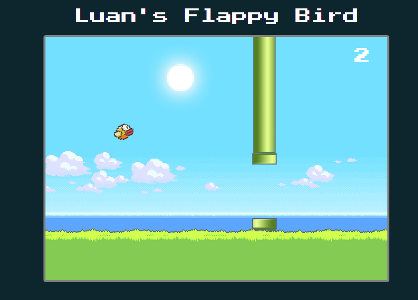

## Flappy Bird em JavaScript

Este projeto é uma implementação do famoso jogo Flappy Bird, desenvolvido com JavaScript puro. Criei esse código para aprimorar meus conhecimentos em JavaScript e como um desafio. O objetivo é oferecer uma experiência de jogo divertida e desafiadora, testando suas habilidades de coordenação e timing.
### Funcionalidades:

- **Jogo Interativo**: Controle o pássaro através de pulos, evitando obstáculos e acumulando pontos.
- **Contagem de Pontos**: O jogo mantém um registro dos pontos obtidos ao passar pelos canos.
- **Tela de Game Over**: Mensagem informativa quando o jogador perde, com opção de reiniciar o jogo.

### Tecnologias Utilizadas:

- **JavaScript**: Todo o código do jogo foi escrito em JavaScript puro, sem bibliotecas externas.
- **HTML/CSS**: A estrutura e o design da interface foram feitos com HTML e CSS.

### Como Usar:

1. Acesse o link do jogo: [Luan's Flappy Bird](https://luans-flappy-bird.vercel.app/)
2. Pressione a tecla de espaço ou clique na tela para fazer o pássaro pular.
3. Tente passar pelos canos e acumular o maior número de pontos!

### Imagem do Jogo:

